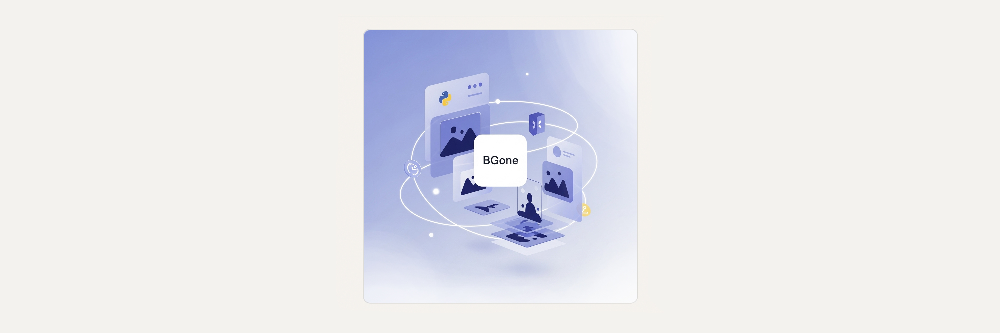
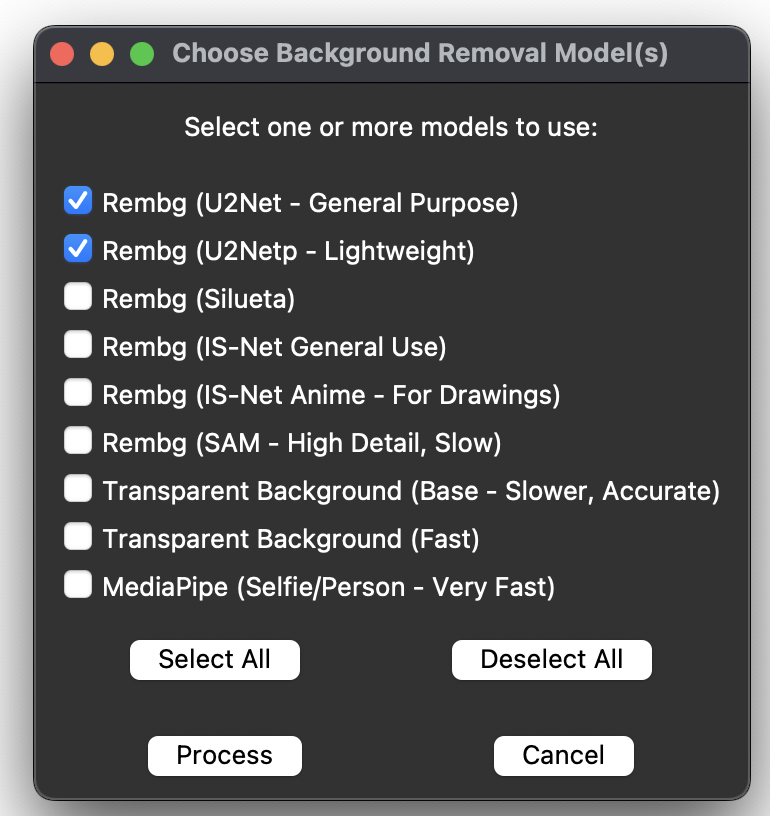
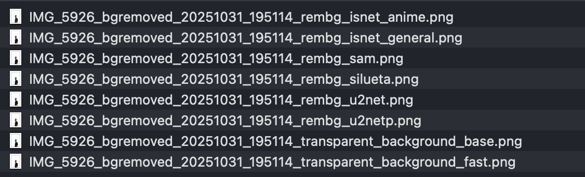
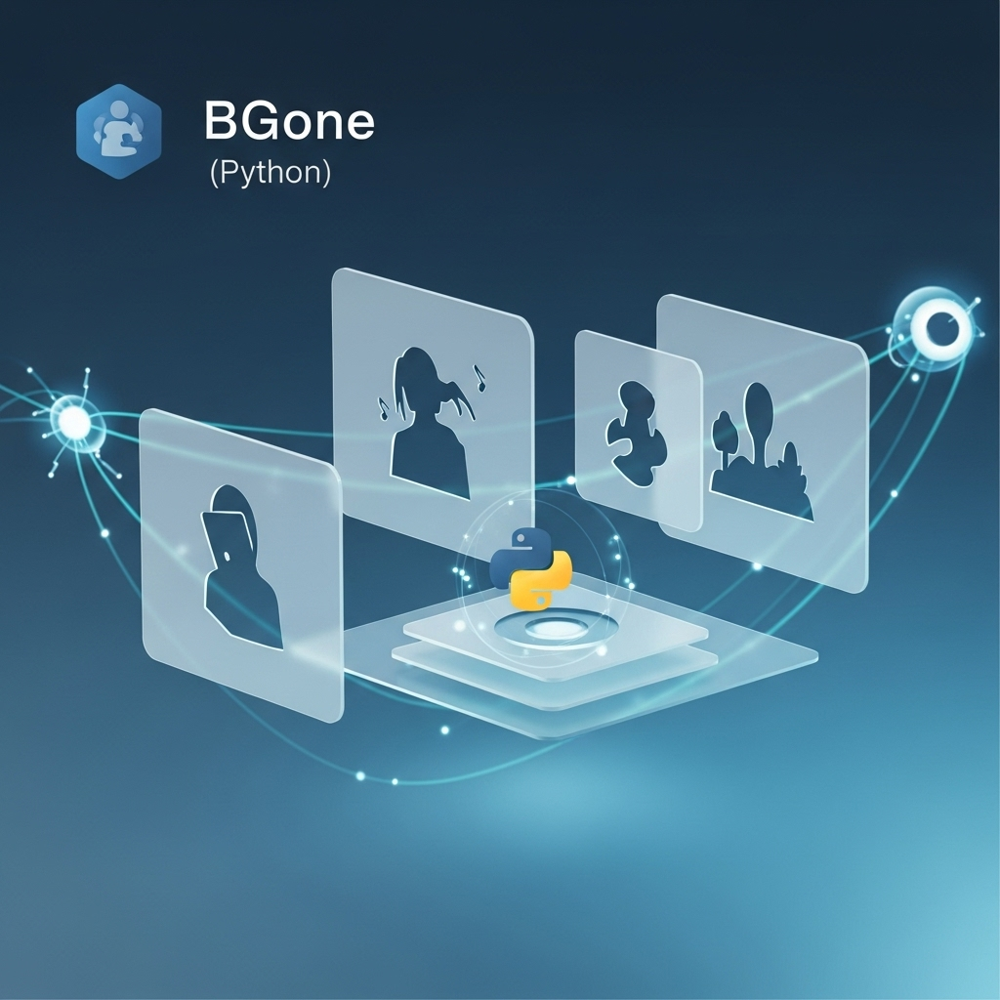

# BGone

A user-friendly, cross-platform GUI utility designed to remove the background from images using a variety of popular AI models. The tool provides a streamlined workflow for artists, designers, and developers to process an image and compare the output of different background removal libraries side-by-side 🖼️✂️


<p align="center">  </p>

**➡️ Read more about the project, its features, and development in my [Medium story.](https://medium.com/@starosta/ai-background-remover-tool-9c30dded5387
)** 


## Table of Contents

- [Overview](#overview)
- [Key Features](#key-features)
- [Installation](#installation)
- [Usage](#usage)
- [Project Structure](#project-structure)
- [Development](#development)
- [Known Issues](#known-issues)
- [Contributing](#contributing)
- [License](#license)
- [Contact](#contact)

## Overview

BGone simplifies the task of background removal by wrapping multiple powerful AI libraries — rembg, transparent-background, and mediapipe — into a single, intuitive graphical interface. Instead of running complex command-line operations or dealing with different library APIs, users can process an image against multiple models at once and directly compare the results.

The core strength of BGone is its comparative workflow. It allows you to see which AI model performs best for your specific image, whether it's a portrait, a product photo, or an anime drawing. The application is designed for efficiency, caching initialized models in memory to speed up subsequent runs.

Problem it Solves:
-   **Model Complexity:** Eliminates the need to install and learn the APIs for multiple different AI background removal libraries.
-   **Comparison Hassle:** Automates the process of running an image through various models. The output files are clearly named with the model used (e.g., my_image_rembg_u2net.png), making side-by-side comparison effortless.
-   **Format Incompatibility:** Natively supports common image formats (PNG, JPEG) as well as the modern HEIC/HEIF format common on mobile devices.

A typical workflow involves:
1.  Launching the script and selecting a local image file.
2.  Choosing a save location and a base filename for the output images.
3.  Selecting one or more AI models from a comprehensive list in a pop-up dialog.
4.  Letting the script process the image with each selected model.
5.  Reviewing the transparent PNG files saved to your chosen directory, each suffixed with the model name.


## Key Features

-   **Multiple AI Model Support:** Integrates several popular models from the rembg, transparent-background, and mediapipe libraries.
-   **Side-by-Side Comparison:** Generates a separate output file for each selected model, making it easy to compare results and choose the best one.
-   **RUser-Friendly GUI:** Built with tkinter for a simple and native cross-platform experience. No command-line knowledge is required.
-   **Broad Format Support:** Natively handles .png, .jpeg, .bmp, and even .heic/.heif files thanks to the pillow-heif library.
-   **Efficient Processing:** Caches initialized model sessions in memory to significantly improve performance on subsequent runs.
-   **Real-Time Logging:** All operations, model initializations, and errors are logged to the console for clear feedback.


## Installation

### Prerequisites

-   Python 3.7+
-   A graphical desktop environment is required to run the `tkinter`-based GUI.

### Clone the Repository

```bash
git clone https://github.com/sztaroszta/BGone.git
cd BGone
```

### Install Dependencies

You can install the required dependency using pip:

```bash
pip install -r requirements.txt
```

*Alternatively, install the dependency manually:*

```bash
pip install pillow pillow-heif rembg transparent-background onnxruntime opencv-python mediapipe numpy
```

## Usage

**1. Run the application:**

```bash
python ai_bg_remover.py
```

**2. Follow the GUI Prompts:**
*   **Select Input Image:** A file dialog will open. Navigate to and select the image you want to process.
*   **Choose Output Location:** A "Save As" dialog will appear. Choose a folder and enter a base name for your output files (e.g., processed_image). The script will automatically add model-specific suffixes.
*   **Select Models:** A dialog window will appear with a list of all available AI models. Check the boxes for the models you want to use. Use the "Select All" and "Deselect All" buttons for convenience.
    <p align="center">  </p>
*   **Process:** Click the "Process" button to begin.
*   **Monitor Console:** Watch the terminal/console for real-time progress, including model initialization and save confirmations.
*   **Review Results:** Once complete, navigate to the output directory you chose. You will find the processed, transparent PNG files, each named with the model that generated it (e.g., processed_image_rembg_u2net.png, processed_image_mediapipe_selfie.png).
    <p align="center">  </p>

## Project Structure

```
BGone/
├── ai_bg_remover.py        # Main script for running the tool
├── README.md               # Project documentation
├── requirements.txt        # List of dependencies
├── .gitignore              # Git ignore file for Python projects
├── assets/                 # Contains screenshots of the application's UI
└── LICENSE                 # MIT License File
```

## Development

**Guidelines for contributors:**

If you wish to contribute or enhance BGone:
-   **Coding Guidelines:** Follow Python best practices (PEP 8). Use meaningful variable names and add clear comments or docstrings.
-   **Testing:** Before submitting changes, please test them locally on different operating systems (macOS, Windows, Linux) to ensure cross-platform compatibility.
-   **Issues/Pull Requests:** Please open an issue or submit a pull request on GitHub for enhancements or bug fixes.

## Known Issues

-   **Test Environment:** This code has been tested only on macOS. Users running it on Windows or Linux may encounter different behavior.
-   **First Run Delay:** The first time a specific model is used, its required AI weights must be downloaded. This may cause a significant delay and requires an active internet connection. Subsequent runs will be much faster as models are loaded from the local cache.
-   **UI Appearanc:** As a tkinter-based application, the look and feel of the GUI may vary slightly across different operating systems (Windows, macOS, Linux) to match native widget styles.

## Contributing

**Contributions are welcome!** Please follow these steps:

1.  Fork the repository.
2.  Create a new branch for your feature or fix.
3.  Commit your changes with descriptive messages.
4.  Push to your fork and submit a pull request.

For major changes, please open an issue first to discuss the proposed changes.

## License

Distributed under the MIT License.
See [LICENSE](LICENSE) for full details.


## Contact

For questions, feedback, or support, please open an issue on the [GitHub repository](https://github.com/sztaroszta/BGone/issues) or contact me directly: 

[](https://www.linkedin.com/in/vitalii-starosta)
[](https://github.com/sztaroszta)
[](https://gitlab.com/sztaroszta)
[](https://bitbucket.org/sztaroszta/workspace/overview)
[](https://gitea.com/starosta) 

Project Showcase: [sztaroszta.github.io](https://sztaroszta.github.io)

```
Erase the background, not your creativity! ✨
```

**Version:** 4  
**Concept Date:** 2025-05-22 

<p align="left"> </p>
